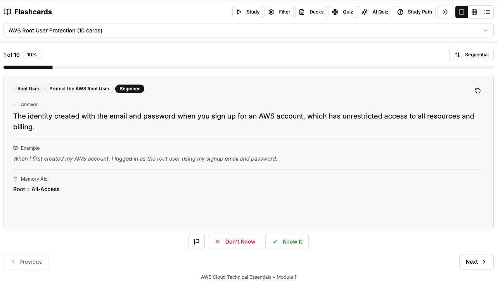

# AI-Enhanced Flashcard Application

A comprehensive, AI-enhanced flashcard application designed to provide a personalized and effective learning experience. This smart study companion not only presents flashcards but actively helps users learn by adapting to their progress and providing intelligent feedback and guidance.



## ✨ Key Features

- Dynamic Deck Management:
  - Load flashcard decks from local JSON files.
  - Upload custom JSON decks directly in the app.
  - Comes with pre-loaded sample decks for immediate use.
- Multiple Study Views:
  - Single Card View: Traditional flip-card experience with shuffle mode.
  - Grid View: View and flip multiple cards at once.
  - List View: Expandable list format to quickly scan questions and answers.
- Intelligent Learning Analytics:
  - Tracks user interactions (confidence, times seen, quiz performance, study time) in localStorage.
  - Provides a personalized dashboard with progress overview and improvement trends.
  - Generates a local study plan to prioritize cards and topics.
- AI-Powered Features (Google Gemini):
  - Custom Study Recommendations: Analyzes learning patterns to provide motivational messages, weekly goals, and a suggested study schedule.
  - Dynamic Quiz Generation: Creates high-quality multiple-choice questions from flashcard content with plausible distractors.
  - AI-Powered Explanations: Generates detailed explanations for incorrect quiz answers, addressing common misconceptions and reinforcing key concepts.

## 🚀 Technology Stack

- Frontend Framework: React with Next.js (App Router)
- Styling: Tailwind CSS & shadcn/ui
- State Management: React Hooks (useState, useEffect) & a custom useLocalStorage hook
- AI Integration: Google Gemini via the Vercel AI SDK (@ai-sdk/openai)
- UI/UX: Responsive, mobile-first design with light/dark modes.

## 🧠 Core Architecture

This application is built around two intelligent systems:

1. Personalized Analytics Engine: All user interactions with flashcards are meticulously tracked and stored locally. This data powers a dashboard that visualizes learning progress and generates a personalized study path, highlighting areas that need more attention and celebrating mastered topics.
2. AI Quiz & Explanation Generator: The app uses Google Gemini to enhance the learning process. When a user requests a quiz, the AI analyzes the selected flashcards to generate relevant multiple-choice questions and challenging distractors. If a user answers incorrectly, the AI provides a detailed, context-aware explanation to clarify the concept and prevent future mistakes. All AI-generated content is cached to ensure a fast and seamless user experience.

## 🛠️ Getting Started

### Prerequisites

- Node.js and npm (or yarn/pnpm) installed.
- A Google Gemini API key.

## Installation

```bash
Clone the repository:
git clone [your-repository-url]
cd [repository-name]
```

### Install dependencies:

```bash
npm install
```

### Set up environment variables:

```bash
Create a .env.local file in the root of the project and add your Google Gemini API key:
NEXT_PUBLIC_GEMINI_API_KEY="your_api_key_here"
```

### Run the development server:

```bash
npm run dev

Open http://localhost:3000 with your browser to see the result.
```
